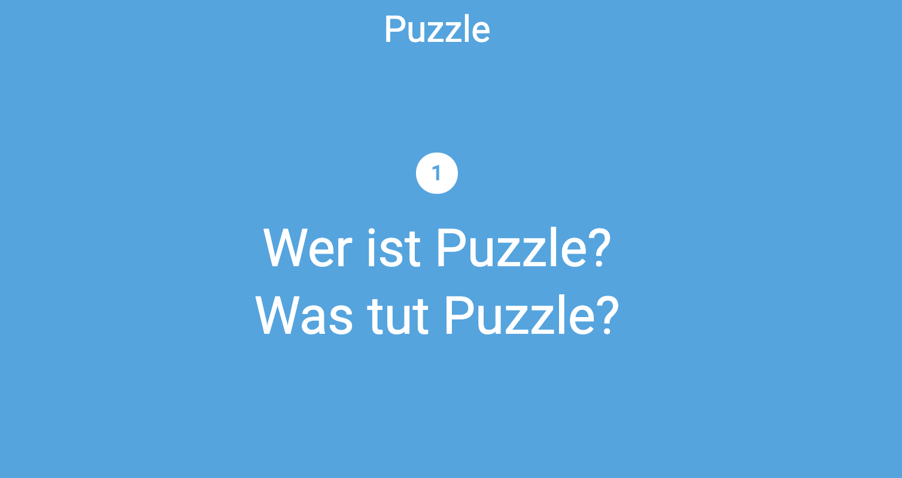
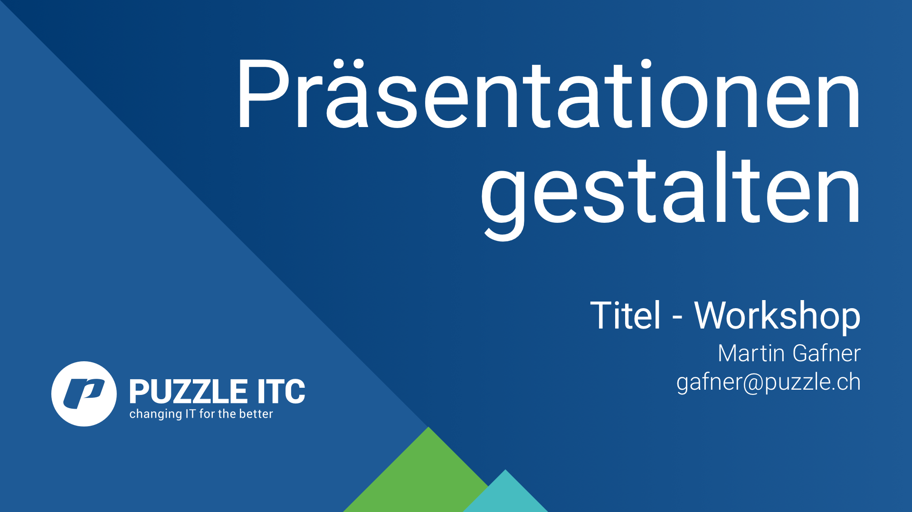
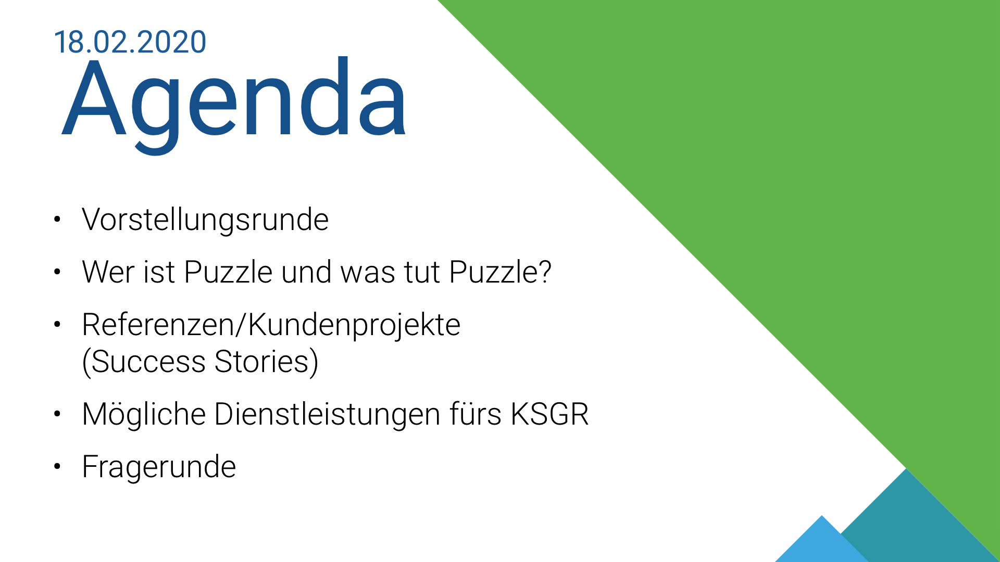
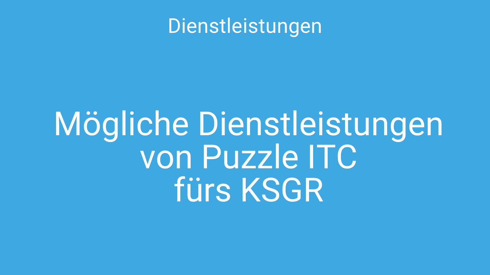
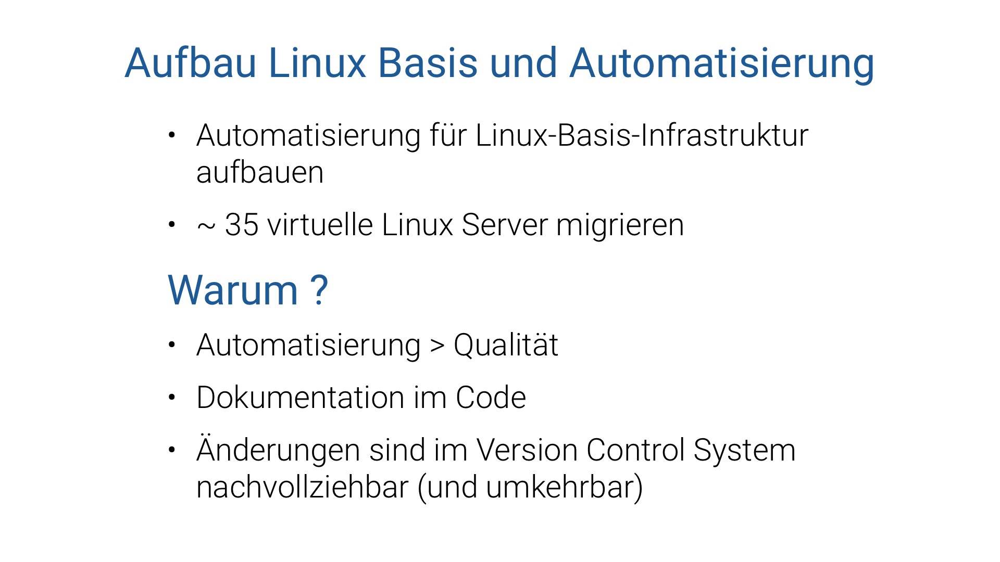
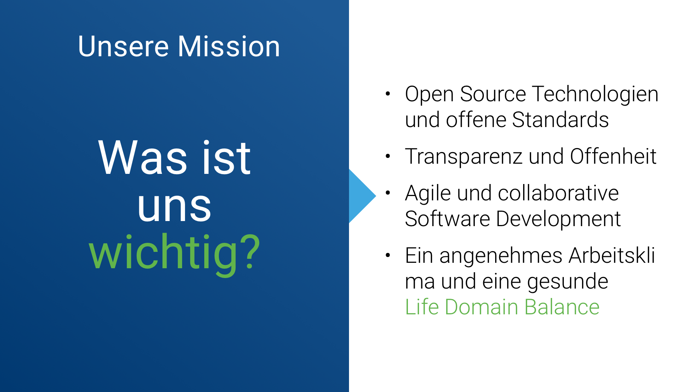
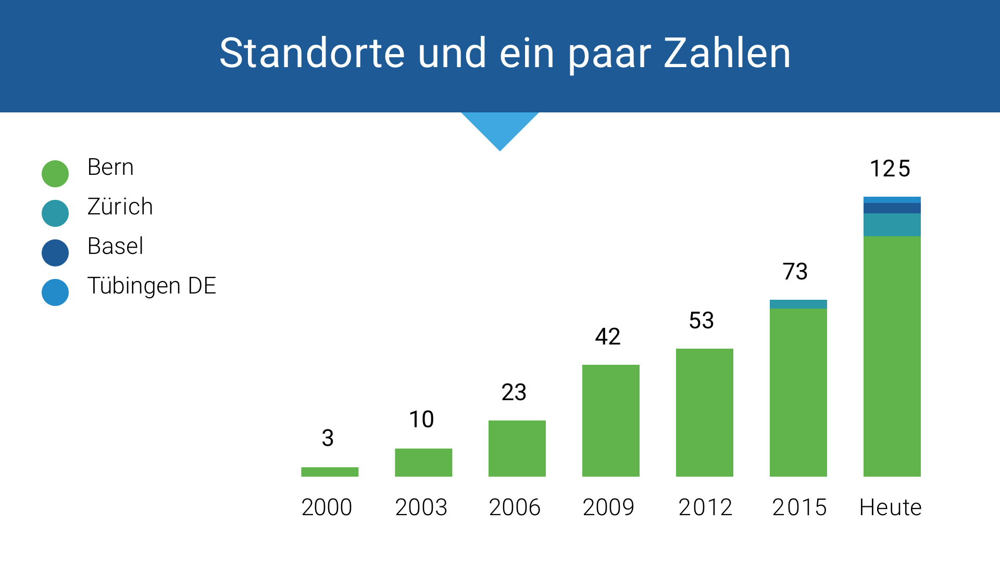
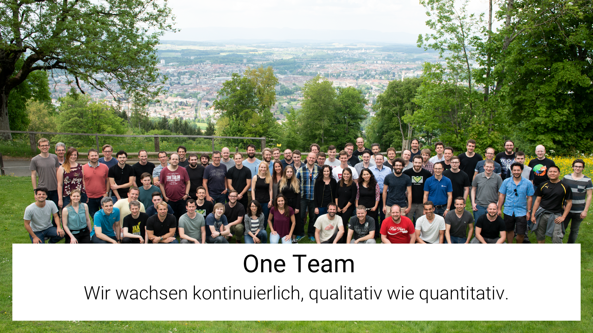
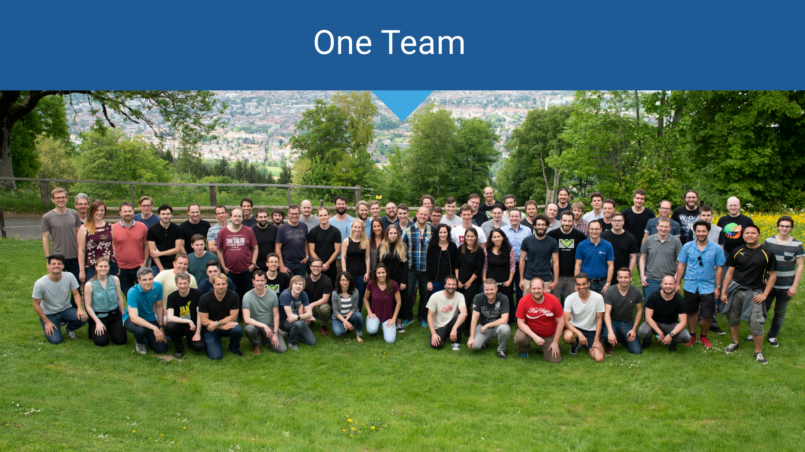

# Puzzle ITC Theme for reveal.js presentation

## Use the theme

To use this reveal.js theme use the following steps:

1. download & setup reveal.js
   [https://github.com/hakimel/reveal.js](https://github.com/hakimel/reveal.js)

2. copy / move the content (folders `css`& `example-presentation`) of the `puzzle-revealjs-theme` repo into your reveal.js root folder

3. Edit the `index.html`

   1. to use the puzzle theme

      ```diff
      - <link rel="stylesheet" href="css/theme/black.css">
      + <link rel="stylesheet" href="css/theme/puzzle.css">
      ```

   2. to use a 16:9 ratio

      ```diff
       Reveal.initialize({
      +  width: 1280,
      +  height: 720,
         hash: true,
         dependencies: [
           ...
      ```

   3. to use your markdown presentation

      ```diff
       <div class="reveal">
         <div class="slides">
      -    <section>Slide 1</section>
      -    <section>Slide 2</section>
      +    <section data-markdown="example-presentation/puzzle-demo.md"
      +             data-separator="^-\*-\*-"
      +             data-separator-vertical="^\*\*\*"
      +             data-separator-notes="^Note:">
      +    </section>
         </div>
       </div>
      ```

## Create / edit a presentation

To create or edit a presentation you can just create a new markdown file or work with the demo presentation in the folder `example-presentation`.

### Code snippets font size
If you want to display a code snippet in a bigger font size you can simply wrap a `<div class="big">` or `<div class="very-big">` around your code block.

### Heading number
To add a continuous number for your headings, just insert `<div class="nr"></div>`.


### Slides

You can use the following slides for your presentation:

- **cover**
  

- **agenda**
  

- **title**
  

- **content**
  

- **left right**
  

- **top head**
  

- **team**
  

- **team-2**
  

- **thanks**
  

### member list

There is a special way to list members

```md
<div class="people">
  <div>
  <div class="img" style="background-image: url(https://www.puzzle.ch/wp-content/uploads/2019/06/Gafner_Martin-1-400x300.jpg)" /></div>

  ### Martin Gafner
  Chief Communications,
  Marketing & Sales

  gafner@puzzle.ch

  </div>
  <div>
  <div class="img" style="background-image: url(https://www.puzzle.ch/wp-content/uploads/2015/07/Fankhauser-Simon-400x300.jpg)" /></div>

  ### Simon Fankhauser
  Head of Business
  Division Z&uuml;rich

  fankhauser@puzzle.ch

  </div>

  ...

</div>
```


